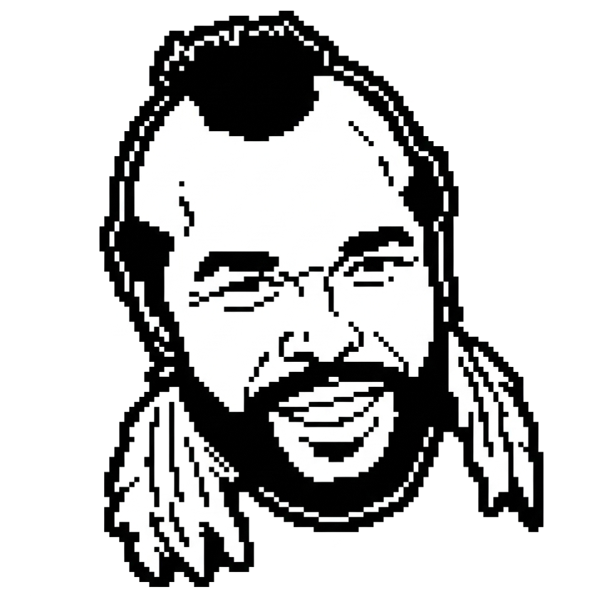

# Talking T



Talking T is a small macOS desktop app that pops up Mr. T in the corner of the screen and speaks short phrases on a schedule.

## Run

```bash
python3 mr_t_talker.py
```

## Build a clickable macOS app (.app)

```bash
python setup.py py2app
```
